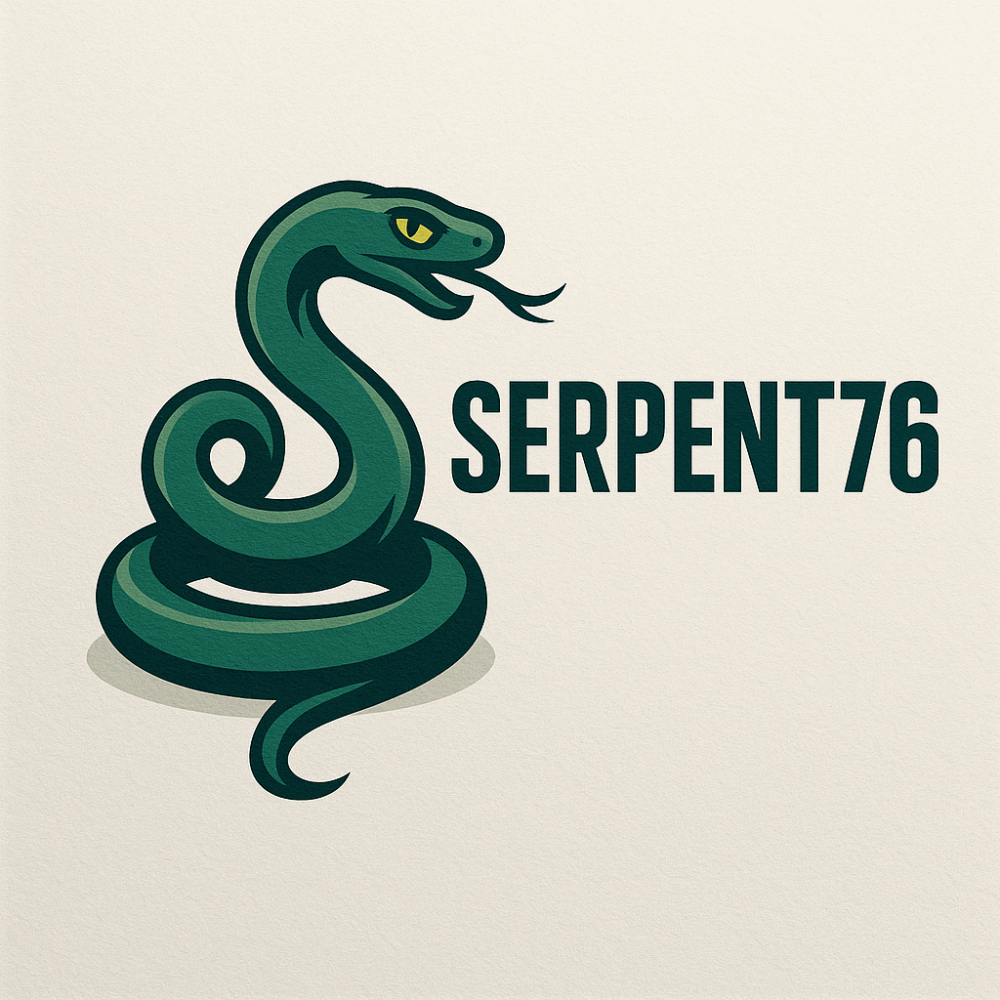

# Serpent 76 - a Fallout 76 Packet Parser

This Python script is designed to parse and analyze network packet logs generated by Fallout 76 (specifically tested with logs like `Client_PLg.0.log`). It reconstructs fragmented UDP packets, decodes various packet types, and dives into the structure of game state update packets. This includes handling LZW compression on the main component data block and Zero Run-Length (ZRL) compression for individual components within that block.

## Overview

Fallout 76 uses a complex network protocol to synchronize game state between the client and server. This parser aims to:

1.  Read packet data captured in log files (JSON format with hex-encoded packet payloads).
2.  Reassemble fragmented UDP packets based on sequence numbers, total fragments, and fragment numbers.
3.  Identify and parse different packet types (Type 0, Ping/Pong, Main game state).
4.  Decode the structure of the main game state packets (Type 130), including headers, acknowledgment information (handling `last_ack`, `base`, `delta`), sequenced/unsequenced message sizes (Rmsg), and component data blocks.
5.  Determine if the main component data block is compressed using LZW based on the `compressed_body_check` field.
6.  Apply **LZW decompression** to the entire component data block if indicated.
7.  Parse the potentially LZW-decompressed block as a stream of "Components" using the `Snapshot` class.
8.  Interpret individual component headers to determine fields like Action, Entity ID, Component ID, Resource ID, data size, and **ZRL compression status**.
9.  Apply **Zero Run-Length (ZRL) decompression** to individual component data if flagged as compressed.
10. Capture component header details for debugging.
11. Provide detailed logging for debugging and analysis.
12. Output the raw, reconstructed packets to a binary file for further inspection.

## Features

*   **Log Parsing:** Reads JSON log entries containing packet direction (`net.packet.recv`/`net.packet.send`) and hex data.
*   **Packet Reconstruction:** Reassembles fragmented UDP packets (Type 130) across multiple log entries, handling sequence number rollovers.
*   **Packet Type Handling:**
    *   Parses basic packet structure (Client ID, Type, Sequence).
    *   Decodes Ping/Pong related packets (Type 128, 129).
    *   Decodes main game state packets (Type 130).
*   **Main Packet Decoding (Type 130):**
    *   Parses frame, flags, sequenced/unsequenced message sizes (Rmsg - *Note: Rmsg content expansion is currently incomplete*).
    *   Extracts ACK information (`last_ack`, `ack_bits`). Parses `last_ack`, `base`, `delta` out for later use
    *   Parses `compressed_body_check` as signed integer to determine if the component block is compressed and its size (`compressed_body`).
    *   Identifies `uncompressed_body` size and `component_count`.
    *   Extracts the raw `component_data` block (potentially LZW compressed).
*   **Two-Layer Decompression:**
    *   **LZW:** Decompresses the entire `component_data` block using LZW if the `compressed_body_check` field indicates compression.
    *   **ZRL:** The `Snapshot` class parses the (potentially LZW-decompressed) data, and the `ZeroRunLengthCompression` class handles ZRL decompression *for individual components* based on their header flags (`IsUncompressed`).
*   **Component Parsing (`Snapshot`):**
    *   Parses the component data stream (after potential LZW decompression) into a list of `Component` objects.
    *   Interprets the component header byte to determine Action, Field lengths, and ZRL compression status.
    *   Extracts EntityID, ComponentID, ResourceID, ComponentSize, and the component payload buffer (`componentBuffer`).
    *   Stores parsed header flags/lengths in the `Component.Header` dictionary for inspection.
*   **Zero Run-Length Compression Class:** A rewritten class (`ZeroRunLengthCompression`) capable of handling ZRL *decompression* by reading from a stream (used by `Snapshot`). *(Note: The class also contains compression logic (`write_byte`, `end`) which is not currently used in the main parsing flow).*
*   **Logging:** Extensive debug logging (`INFO` level by default) to trace the parsing process.
*   **Output:** Saves the reconstructed raw packet payloads to `reconstructed_packets.bin`.
*   **Testing:** Includes a basic test function for the `Snapshot` component parsing logic.

## Requirements

*   Python 3.6+ (due to f-strings, type hints)
*   Standard Python libraries (`json`, `datetime`, `collections`, `struct`, `logging`, `io`, `typing`) - no external dependencies required.

## Installation

1.  Clone the repository:
    ```bash
    git clone https://github.com/Coriana/Serpent76.git
    cd Serpent76
    ```
2.  Place your Fallout 76 packet log file (e.g., `Client_PLg.0.log`) in the same directory as `packet_parse.py`.

## Usage

1.  **Ensure Log File Exists:** Make sure the log file specified in the `main()` function (default: `"Client_PLg.0.log"`) is present in the script's directory.
2.  **Run the Script:**
    ```bash
    python packet_parse.py
    ```
3.  **Output:**
    *   **Console:** Logs will be printed to the console (default level: INFO). This includes high-level processing steps, parsed component details (if logging level is set to DEBUG), warnings about missing fragments, and errors.
    *   **`reconstructed_packets.bin`:** A binary file containing the raw payloads of the successfully reconstructed packets (Types 128, 129, 130) in the order they were processed.

4.  **Run Tests:** To run the built-in test for component parsing:
    ```bash
    python packet_parse.py test
    ```

## Code Structure

*   **`packet_parse.py`:** The main script.
    *   **`Component` class:** Represents a single game state component. Now includes a `Header` dict.
    *   **`ZeroRunLengthCompression` class:** Handles ZRL decompression. Reads from an input stream.
    *   **`Snapshot` class:** Parses a block of (potentially LZW-decompressed) data into `Component` objects, using `ZeroRunLengthCompression` for ZRL-compressed components.
    *   **`parse_packet_udp`:** Parses the initial UDP header/fragment info from a log entry.
    *   **`parse_packet_ping`:** Parses the payload of Type 128/129 packets.
    *   **`parse_packet_main`:** Parses the payload of Type 130 packets, including Rmsg headers, ACK/Delta info (signed fields), compression checks, and extracts the component data block.
    *   **`lzw_decompress`:** Standalone function to perform LZW decompression. Used in `main`.
    *   **`reconstruct_packets`:** Orchestrates the reassembly of fragmented packets from log entries.
    *   **`process_packet_components`:** (No longer directly called in `main` loop) Helper concept, now integrated into `main`.
    *   **`test_snapshot_parsing`:** Contains test code for the `Snapshot` parser.
    *   **`main`:** Entry point. Reads logs, reconstructs packets, parses Type 130 headers, **performs LZW decompression if needed**, **iterates through `component_count` calling `Snapshot` (which handles ZRL)**, performs delta checks, and writes the output file.

## Limitations & TODOs

*   **Rmsg Data:** The script identifies the presence and size of sequenced (`rmsg_data`) and unsequenced (`unseq_rmsg_data`) messages within Type 130 packets, but **it does not currently parse the *content* of these Rmsgs**. Further research is needed.
*   **LZW Specifics:** The `lzw_decompress` function implements a standard LZW algorithm. While functional, the exact parameters used by Fallout 76 (e.g., dictionary size limits, code size progression) are inferred and might differ slightly from the game's implementation.
*   **ZRL Compression Logic:** The `ZeroRunLengthCompression` class includes methods for *compressing* data, but these are not used by the current packet *parsing* logic.
*   **Component Payload Analysis:** The script successfully extracts the `componentBuffer` for each component (after LZW and ZRL decompression), but it does not interpret the *meaning* of the data within these buffers. This requires game-specific reverse engineering for each `ComponentId`.
*   **Error Handling:** While improved, complex or corrupted log files or unexpected packet variations might still cause issues.
*   **Protocol Accuracy:** This parser is based on observed patterns. The Fallout 76 network protocol is proprietary and subject to change, potentially breaking the parser after game updates.

## Contributing

Contributions are welcome! If you have insights into the packet structures (especially Rmsgs or component payloads), find bugs, or want to improve the code, please feel free to:

1.  Open an Issue to discuss the change or report a bug.
2.  Fork the repository, make your changes, and submit a Pull Request.

## Disclaimer

This tool is provided for educational and research purposes only. It is based on reverse engineering efforts and is not affiliated with or endorsed by Bethesda Game Studios or ZeniMax Media. Using this tool to interact with live game servers may violate the game's Terms of Service.